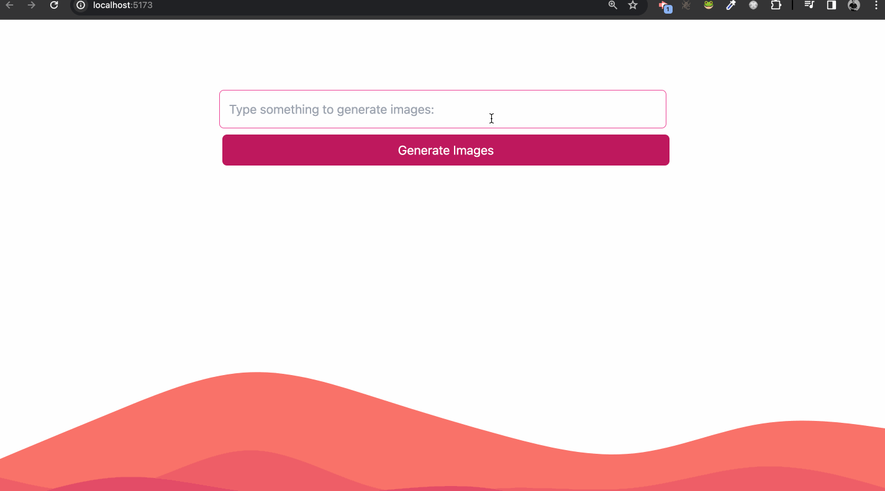

# Image Generator Open AI and DALL-E

Image Generator Web Application using OpenAI and DALL-E to generate the four images for you.

As commented above, this app wil provide a example of:



## OpenAI

OpenAI has trained cutting-edge language models that are very good at understanding and generating text. Our API provides access to these models and can be used to solve virtually any task that involves processing language.

You can generate you API KEY on: https://platform.openai.com/account/api-keys

## Environments

It should create a `.env` file with bellow api keys

| Environment          | Description        |
| -------------------- | ------------------ |
| VITE_OPEN_AI_API_KEY | API Key of OPEN AI |

## Pre-requisites

- Node
- Yarn or NPM

## How to run?

1. Install dependencies

```sh
yarn
```

or

```sh
npm install
```

2. Running the project

```sh
yarn dev
```

or

```sh
npm run dev
```

## About Project

It will be using some tools:

- Vite: frontend tooling
- Tailwind: styling
- OpenAI and DALL-E: AI to generate locations

For the background of the page I used the Haikei App that will generate a svg for you and can be used anywhere:

Haikei: https://app.haikei.app/
